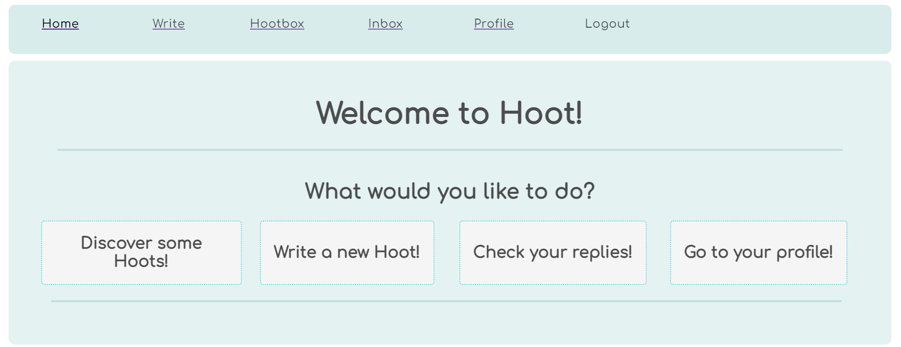
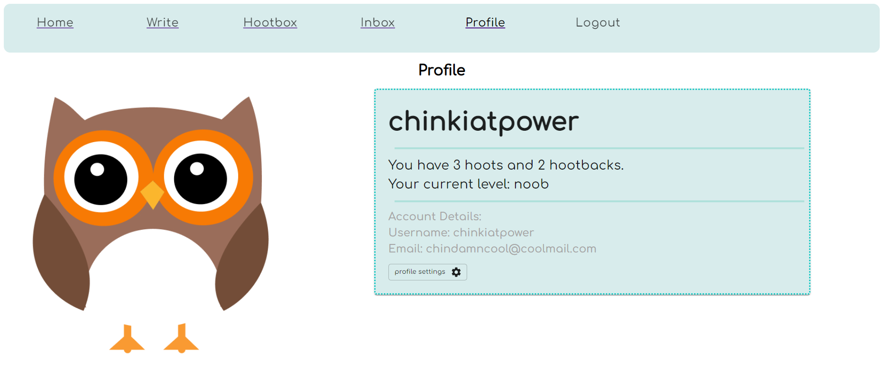
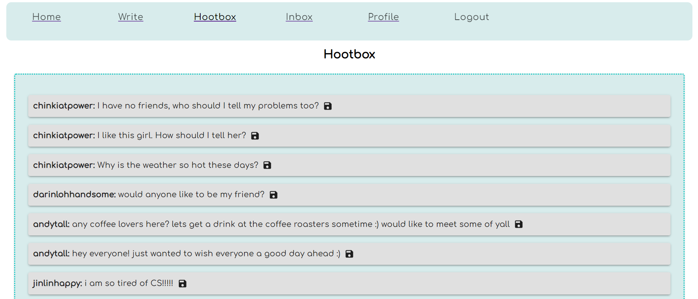
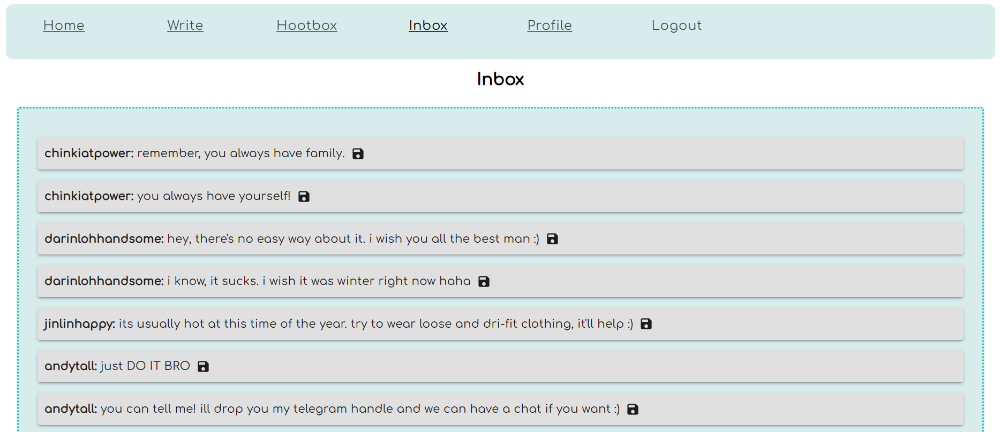
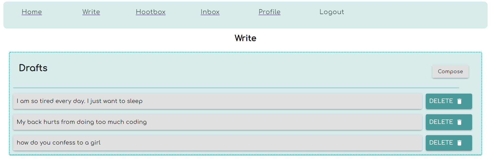
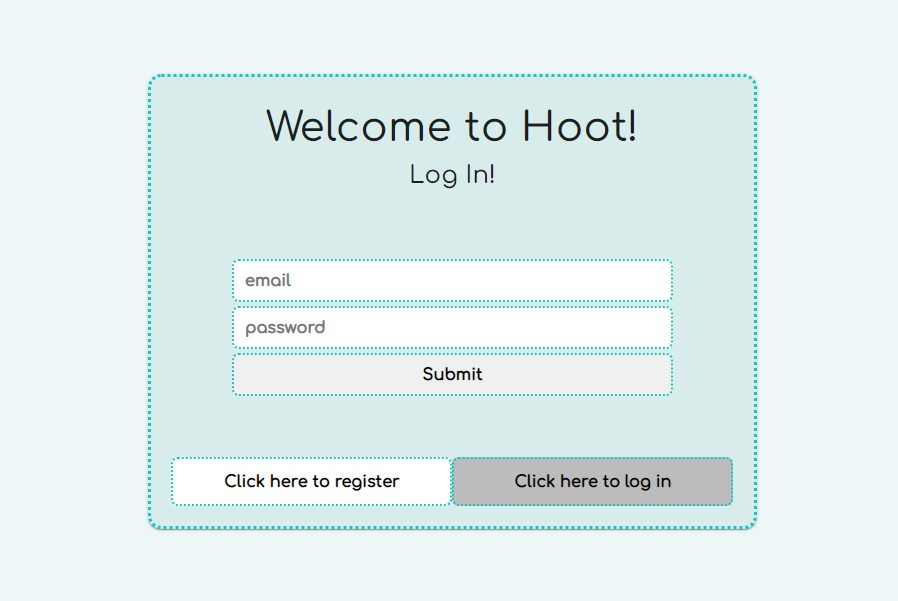

# Hoot

---

A safe space where you can share your thoughts anonymously!

## Introduction

---

- Hoot is a platform for users to post messages to a public forum.
- Private replies from other users.
- Toxicity is not tolerated!

More UI screenshots below:

## Developers

---

### Installation

- cd into the client directory by running `cd client` from the root directory.
- install dependencies by running `npm install`.
- repeat with server directory by running `cd server` from the root directory then `npm install`.

### Database setup

- create a PostgreSQL database on your local machine.
- run the SQL code in the server/hoot.sql to create the database schema for hoot.
- in the server directory, run `cp .env.example .env`.
- in the .env folder, fill in all the relevant details. (default port for PostgreSQL database is 5432)

### Running the backend

- cd into the server directory by running `cd server` from the root directory.
- run the backend by running `npm start`.

### Running the frontend

- cd into the client directory by running `cd client` from the root directory.
- run the frontend by running `npm start`.
- your browser should open a window showing the UI. (Default port for React is 3000, so you can navigate to the UI in your browswer by going to localhost:3000)
- you should be seeing the login page as shown:

P.S. there is a "dev mode" button in the UI which populates the database with a few "bot" users for testing purposes.

## Authors

---

- Tan Chin Kiat
- Darin Loh Wei Ming
